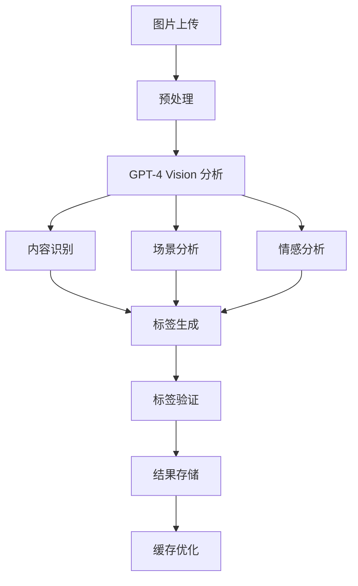

# AI 智能分析

PixelPunk 集成了最先进的 AI 技术，为每张上传的图片提供深度智能分析，让图片管理更加智能化和高效。

## 概述

基于 **GPT-4 Vision** 的强大能力，PixelPunk 能够理解图片内容，自动生成标签、描述和安全评估，为用户提供前所未有的智能图片管理体验。

### 🎯 核心优势

- **🧠 深度理解**: 基于最先进的视觉理解模型
- **⚡ 快速处理**: 2-5秒完成完整分析
- **🎯 高准确率**: 平均准确率达 95%+
- **🔄 批量处理**: 支持批量智能分析
- **💰 成本优化**: 智能缓存减少 API 调用

## 功能详解

### 1. 智能标签生成

自动识别图片中的各种元素，生成多维度标签。

#### 标签类型

| 类型 | 描述 | 示例 |
|------|------|------|
| **物体识别** | 识别图片中的具体物体 | 汽车、建筑、动物、食物 |
| **场景分类** | 识别图片的拍摄场景 | 室内、户外、自然、城市 |
| **人物特征** | 识别人物相关信息 | 人数、年龄段、表情、动作 |
| **情感色彩** | 分析图片传达的情感 | 快乐、悲伤、宁静、激动 |
| **风格特征** | 识别图片的艺术风格 | 摄影、插画、水彩、油画 |
| **色彩主题** | 分析图片的色彩特征 | 暖色调、冷色调、高对比度 |
| **构图特点** | 分析图片的构图特征 | 对称、黄金分割、特写、全景 |
| **用途分类** | 判断图片的适用场景 | 壁纸、头像、海报、图标 |

#### 智能算法



#### 示例分析结果

**输入图片**: 一张海边日落的风景照片

**生成标签**:
```json
{
  "objects": ["太阳", "海洋", "云朵", "岩石"],
  "scene": ["户外", "自然风光", "海滩"],
  "mood": ["宁静", "浪漫", "温暖"],
  "style": ["摄影", "自然光", "黄金时段"],
  "colors": ["暖色调", "金黄色", "橙红色"],
  "composition": ["水平构图", "三分法", "前景"],
  "usage": ["壁纸", "装饰画", "旅游宣传"]
}
```

### 2. 内容安全检测

采用先进的内容审核技术，确保平台内容安全。

#### NSFW 检测

**检测维度**:
- **成人内容**: 成人相关的不当内容
- **暴力内容**: 血腥、暴力场面
- **不良图像**: 恶心、令人不适的内容
- **敏感信息**: 个人隐私、敏感数据

**评分系统**:
```
安全等级评分 (0-100):
- 0-20:   高风险内容，自动拒绝
- 21-40:  中等风险，需要审核
- 41-60:  轻微风险，标记提醒
- 61-80:  基本安全，正常展示
- 81-100: 完全安全，推荐内容
```

#### 自定义安全策略

```yaml
# 安全配置示例
content_safety:
  # 全局安全等级
  global_threshold: 60
  
  # 分类阈值
  thresholds:
    adult: 30
    violence: 20
    disturbing: 40
    
  # 自动处理
  auto_actions:
    reject_below: 20
    review_below: 40
    approve_above: 80
    
  # 特殊处理
  special_rules:
    - type: "医疗图片"
      threshold: 40
    - type: "艺术作品"
      threshold: 30
```

### 3. 智能描述生成

为每张图片生成详细的文字描述，便于搜索和管理。

#### 描述特点

- **长度控制**: 100-200 字的详细描述
- **多语言支持**: 中文、英文等多种语言
- **结构化内容**: 按主题、细节、情感分层描述
- **SEO 优化**: 包含关键词，便于搜索引擎收录

#### 描述模板

**基础模板**:
```
这是一张{场景类型}的{图片类型}，主要展示了{主要内容}。
图片中可以看到{具体细节}，整体呈现出{色彩特征}的视觉效果。
{情感描述}，{构图分析}，适合用作{推荐用途}。
```

**示例描述**:
> 这是一张户外自然风光的摄影作品，主要展示了海边的壮丽日落景象。图片中可以看到金黄色的太阳正缓缓落入海平面，波光粼粼的海面映衬着橙红色的晚霞，远处的云朵被染成了温暖的色彩。整体呈现出暖色调的视觉效果，营造出宁静而浪漫的氛围。画面采用经典的三分法构图，前景的岩石增加了层次感，适合用作桌面壁纸或装饰画。

### 4. 图片质量评估

从技术角度分析图片质量，为用户提供客观的质量指标。

#### 评估维度

| 指标 | 描述 | 评分范围 |
|------|------|----------|
| **清晰度** | 图片的锐度和细节表现 | 0-100 |
| **亮度** | 图片的整体亮度水平 | 0-100 |
| **对比度** | 明暗差异的强度 | 0-100 |
| **色彩饱和度** | 颜色的鲜艳程度 | 0-100 |
| **噪点水平** | 图片的噪点程度 | 0-100 |
| **构图质量** | 构图的美学评价 | 0-100 |

#### 质量报告示例

```json
{
  "overall_score": 85,
  "technical_quality": {
    "sharpness": 88,
    "brightness": 82,
    "contrast": 90,
    "saturation": 78,
    "noise_level": 92,
    "composition": 86
  },
  "recommendations": [
    "图片整体质量优秀，色彩表现良好",
    "建议略微提升饱和度增强视觉效果",
    "构图平衡，适合多种用途"
  ],
  "suitable_for": [
    "高质量打印",
    "网站展示",
    "社交媒体分享"
  ]
}
```

### 5. 色彩分析

深度分析图片的色彩特征，提供详细的色彩信息。

#### 分析内容

**主导色提取**:
- 提取图片中的主要颜色
- 按比例排序色彩重要性
- 提供 RGB、HEX、HSL 等格式

**调色板生成**:
- 生成 5-10 色的配色方案
- 和谐色彩搭配建议
- 适用场景推荐

**色彩情感分析**:
- 分析色彩传达的情感
- 色彩心理学应用
- 品牌色彩匹配

#### 色彩数据示例

```json
{
  "dominant_colors": [
    {
      "hex": "#FF6B35",
      "rgb": [255, 107, 53],
      "hsl": [18, 100, 60],
      "percentage": 35.2,
      "name": "橙红色"
    },
    {
      "hex": "#F7931E",
      "rgb": [247, 147, 30],
      "hsl": [32, 93, 54],
      "percentage": 28.7,
      "name": "橙黄色"
    }
  ],
  "color_palette": [
    "#FF6B35", "#F7931E", "#FFD23F", 
    "#4ECDC4", "#45B7D1", "#96CEB4"
  ],
  "color_mood": ["温暖", "活力", "积极"],
  "color_harmony": "暖色调和谐",
  "brand_match": ["运动品牌", "活力产品", "创意设计"]
}
```

### 6. AI 推荐系统

基于图片特征智能推荐相关内容和用途。

#### 推荐维度

**相似图片推荐**:
- 基于视觉特征相似度
- 内容主题相关性
- 风格一致性匹配

**用途推荐**:
- 壁纸适用性评估
- 头像合适度分析
- 商用价值评估

**标签推荐**:
- 相关标签建议
- 标签热度排序
- 个性化标签定制

#### 推荐算法

```python
def calculate_similarity(image1_features, image2_features):
    """计算图片相似度"""
    # 视觉特征相似度
    visual_similarity = cosine_similarity(
        image1_features['visual'], 
        image2_features['visual']
    )
    
    # 内容相似度
    content_similarity = jaccard_similarity(
        image1_features['tags'], 
        image2_features['tags']
    )
    
    # 色彩相似度
    color_similarity = color_distance(
        image1_features['colors'], 
        image2_features['colors']
    )
    
    # 综合相似度
    total_similarity = (
        visual_similarity * 0.5 +
        content_similarity * 0.3 +
        color_similarity * 0.2
    )
    
    return total_similarity
```

## 配置与使用

### AI 服务配置

#### OpenAI 配置

```yaml
ai:
  enabled: true
  provider: "openai"
  openai:
    api_key: "your_openai_api_key"
    model: "gpt-4-vision-preview"
    base_url: "https://api.openai.com/v1"
    max_tokens: 4096
    temperature: 0.1
    timeout: 30s
```

#### 自定义提示词

```yaml
ai:
  prompts:
    tagging: |
      请分析这张图片并生成相关标签。
      要求：
      1. 识别主要物体和场景
      2. 分析情感和风格特征
      3. 判断适用场景
      4. 以JSON格式返回结果
      
    description: |
      请为这张图片生成一段详细的中文描述，
      要求100-200字，包含主要内容、细节特征、
      情感氛围和推荐用途。
      
    safety: |
      请评估这张图片的内容安全性，
      检查是否包含成人内容、暴力、
      不当信息等，给出0-100的安全评分。
```

### 批量处理

#### API 接口

```http
POST /api/ai/batch-analyze
Content-Type: application/json
Authorization: Bearer your_token

{
  "image_ids": [1, 2, 3, 4, 5],
  "features": ["tags", "description", "safety", "quality"],
  "options": {
    "cache_results": true,
    "notify_completion": true
  }
}
```

#### 处理队列

```go
// 批量处理任务
type BatchAnalysisTask struct {
    ID       string   `json:"id"`
    ImageIDs []int    `json:"image_ids"`
    Features []string `json:"features"`
    Status   string   `json:"status"`
    Progress int      `json:"progress"`
    Results  []Result `json:"results"`
}

// 异步处理
func ProcessBatchAnalysis(task *BatchAnalysisTask) {
    for i, imageID := range task.ImageIDs {
        result := analyzeImage(imageID, task.Features)
        task.Results = append(task.Results, result)
        task.Progress = (i + 1) * 100 / len(task.ImageIDs)
        
        // 更新进度
        updateTaskProgress(task)
    }
    
    task.Status = "completed"
    notifyCompletion(task)
}
```

### 性能优化

#### 缓存策略

```yaml
ai:
  cache:
    # Redis 缓存
    redis:
      enabled: true
      ttl: "7d"
      key_prefix: "ai_analysis:"
    
    # 本地缓存
    local:
      enabled: true
      size: "100MB"
      ttl: "1h"
    
    # 缓存策略
    strategy:
      # 相同图片 MD5 复用结果
      duplicate_detection: true
      # 相似图片部分复用
      similarity_threshold: 0.9
```

#### 并发控制

```yaml
ai:
  concurrency:
    # 最大并发请求数
    max_concurrent: 5
    # 请求队列大小
    queue_size: 100
    # 超时时间
    timeout: "60s"
    # 重试策略
    retry:
      max_attempts: 3
      backoff: "exponential"
```

### 成本优化

#### 智能缓存

- **MD5 去重**: 相同图片直接复用结果
- **相似度检测**: 相似图片部分复用分析
- **结果缓存**: 长期缓存分析结果
- **增量更新**: 只分析新增特征

#### API 调用优化

```go
// 成本优化策略
func OptimizedAnalysis(imageID int, features []string) (*AnalysisResult, error) {
    // 1. 检查缓存
    if cached := getFromCache(imageID); cached != nil {
        return cached, nil
    }
    
    // 2. 检查重复图片
    if duplicate := findDuplicate(imageID); duplicate != nil {
        return copyAnalysis(duplicate), nil
    }
    
    // 3. 检查相似图片
    if similar := findSimilar(imageID, 0.9); similar != nil {
        return adaptAnalysis(similar, imageID), nil
    }
    
    // 4. 执行新分析
    result := performAnalysis(imageID, features)
    
    // 5. 缓存结果
    cacheResult(imageID, result)
    
    return result, nil
}
```

## 最佳实践

### 1. 合理使用 AI 功能

**推荐策略**:
- 新上传图片自动分析核心特征
- 批量历史图片选择性分析
- 根据使用场景选择分析功能
- 定期清理和更新分析结果

### 2. 优化分析性能

**技术要点**:
- 合理设置并发数量
- 利用缓存减少重复分析
- 选择合适的图片尺寸
- 监控 API 使用量和成本

### 3. 自定义分析流程

**配置示例**:
```yaml
ai:
  workflows:
    # 快速分析流程
    quick:
      features: ["tags", "safety"]
      timeout: "10s"
      
    # 完整分析流程
    complete:
      features: ["tags", "description", "safety", "quality", "colors"]
      timeout: "30s"
      
    # 商用分析流程
    commercial:
      features: ["tags", "description", "safety", "quality", "colors", "recommendations"]
      timeout: "60s"
      quality_threshold: 80
```

### 4. 监控和维护

**监控指标**:
- API 调用次数和成本
- 分析成功率和错误率
- 处理时间和性能指标
- 缓存命中率和效果

**维护任务**:
- 定期更新 AI 模型版本
- 优化提示词和参数
- 清理过期缓存数据
- 分析结果质量评估

通过 PixelPunk 的 AI 智能分析功能，你可以实现真正智能化的图片管理，大大提升工作效率和用户体验。