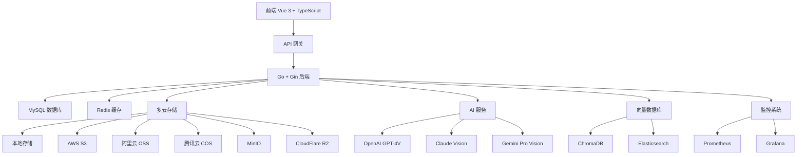

# 介绍

欢迎使用 **PixelPunk** - 企业级智能图床平台，集成AI智能分析、向量搜索、多云存储和企业管理于一体。

## 什么是 PixelPunk？

PixelPunk 是一个面向企业级应用的智能图片管理平台，支持从个人开发者到大型企业的全场景应用，提供完整的数字资产管理解决方案。

### 🎯 核心特点

- **🤖 AI 智能分析**: 集成多模型(GPT-4V、Claude、Gemini)，提供深度图像理解
- **🔍 向量搜索**: 1536维语义搜索，支持以图搜图和智能推荐
- **☁️ 多云存储**: 支持 6+ 云存储提供商，动态负载均衡
- **⚡ CDN 加速**: 全球 200+ 节点，带宽控制和成本优化
- **🛡️ 企业安全**: 多层安全防护、合规监管和数据加密
- **👑 企业管理**: 多组织架构、权限控制和成本管理

### 🏗️ 技术架构

### 📊 项目规模

- **后端**: 80+ API 接口，完整的微服务架构
- **前端**: 35+ 页面组件，企业级组件库
- **数据库**: 25+ 数据表，完整的关系设计
- **AI 模型**: 8+ 智能模型，1536维向量空间
- **存储**: 支持 6+ 云存储提供商
- **CDN**: 200+ 全球节点，智能路由
- **安全**: 15+ 安全特性，企业级防护
- **管理**: 45+ 管理功能，多组织支持

## 适用场景

### 🧠 AI 研究团队
- 基于向量搜索构建研究数据集
- 多模型AI分析和对比
- 智能检索和知识管理

### 🏢 企业级应用
- 大型企业数字资产管理
- 多组织架构和权限控制
- 合规监管和成本控制

### 🚀 创业公司
- 快速搭建素材库和内容平台
- 弹性扩展和成本优化
- CDN加速和全球分发

### 🎨 内容创作平台
- 支持大量创作者的多媒体平台
- 版权保护和内容分发
- 智能推荐和个性化

### 🏭 政府机构
- 政务数字化平台和公共服务
- 高安全等级和合规性要求
- 审计追踪和数据保护

### 🏫 教育机构
- 在线教育的教学资源管理
- 知识管理和学习分析
- 大规模并发和数据存储

## 为什么选择 PixelPunk？

### 🚀 现代化技术栈
采用最新的技术栈，保证系统的性能、稳定性和可扩展性。

### 🔧 开箱即用
提供完整的解决方案，从部署到使用，简单快捷。

### 🛡️ 企业级安全
完善的权限控制、内容审核和安全机制。

### 📈 可扩展性
支持水平扩展，可以从个人使用扩展到企业级应用。

### 💰 成本优化
支持多种存储方案，可以根据需求选择最优成本的存储策略。

## 下一步

- [快速开始](./getting-started.md) - 快速部署和使用
- [安装部署](./installation.md) - 详细的安装指南
- [功能特性](./features.md) - 了解所有功能
- [API 文档](./api/overview.md) - 开发者接口文档

## 社区支持

- 💬 [QQ群 (826708512)](https://qm.qq.com/cgi-bin/qm/qr?k=826708512)
- 🐛 [GitHub Issues](https://github.com/CooperJiang/PixelPunk/issues)
- 📧 [邮件支持](mailto:support@pixelpunk.io)
- 📖 [开发博客](https://blog.pixelpunk.io)

---

**准备开始了吗？** [立即开始使用 PixelPunk →](./getting-started.md)